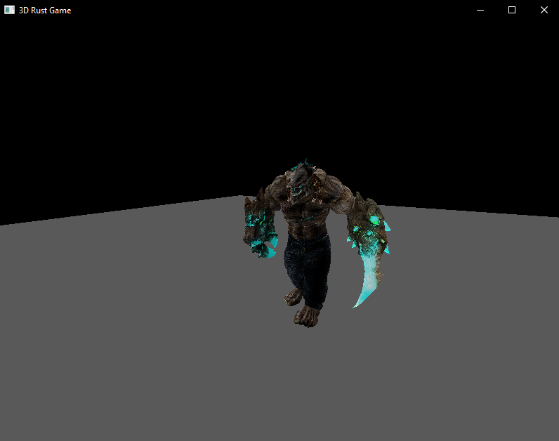

## Rust 3d game with [WGPU](https://wgpu.rs/)

- Todo: 
    - [x] Compiler
    - [x] Animations
    - [x] Texture
    - [ ] Shadow

- Running

    - Compile animations:
    
            > blender --background --python compiler.py
        
    - Compile meshes and textures:
    
            > cargo run --bin compile --release
            
    - Running:
    
            > cargo run --release

- Screenshot:

    
